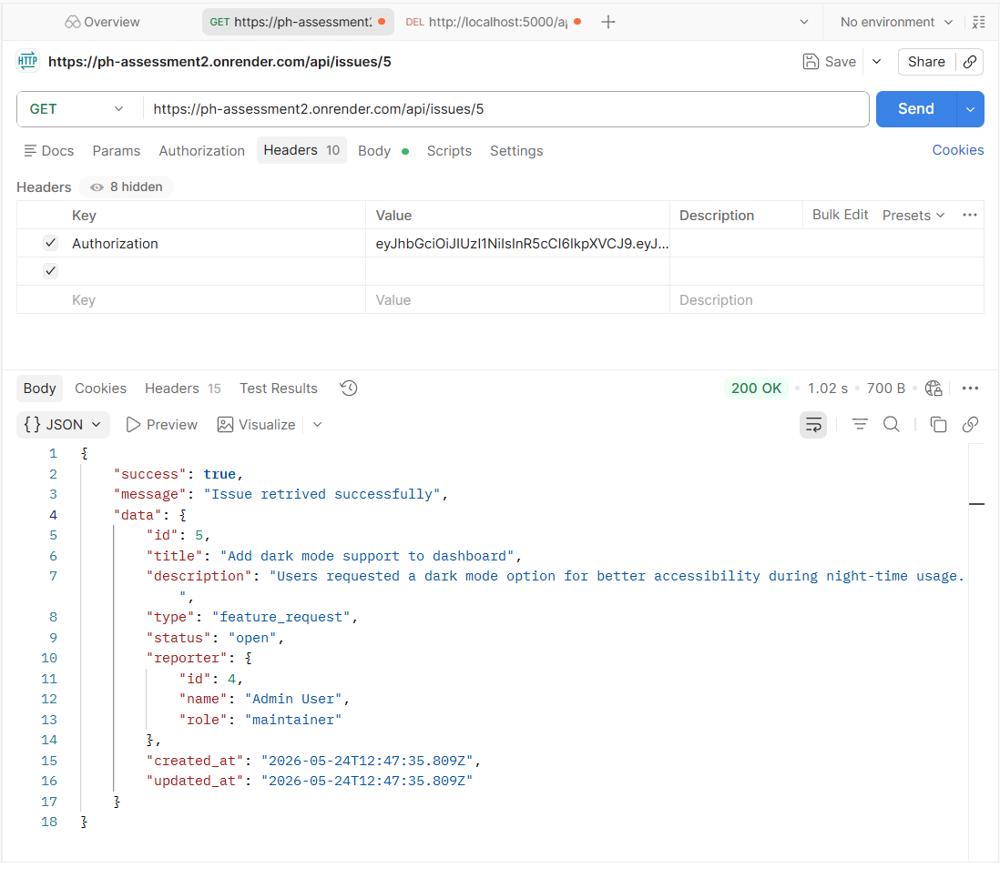

# DevPulse API

Internal tech issue and feature tracker built with Node.js, TypeScript, Express, PostgreSQL, raw SQL, bcrypt, and JWT.

## Features

- User registration and login
- JWT authentication
- Contributor and maintainer permissions
- Create, view, update, and delete issues
- Issue sorting and filtering
- PostgreSQL schema for Supabase or any hosted PostgreSQL database

## Tech Stack

- Node.js
- TypeScript
- Express.js
- PostgreSQL with native `pg`
- Raw SQL with `pool.query()`
- bcrypt
- jsonwebtoken

## Setup

1. Install dependencies:

```bash
npm install
```

2. Create `.env`:

```env
PORT=5000
DATABASE_URL=postgresql://postgres:[YOUR-PASSWORD]@[YOUR-SUPABASE-HOST]:5432/postgres
JWT_SECRET=your_jwt_secret
SALT_ROUNDS=10
```

3. Run `schema.sql` in Supabase SQL Editor.

4. Start the development server:

```bash
npm run dev
```

## API Endpoints

### Authentication

- `POST /api/auth/signup`
- `POST /api/auth/login`

### Issues

- `POST /api/issues`
- `GET /api/issues?sort=newest&type=bug&status=open`
- `GET /api/issues/:id`
- `PATCH /api/issues/:id`
- `DELETE /api/issues/:id`

Protected endpoints require:

```http
Authorization: <JWT_TOKEN>
```

## Database Schema Summary

### users

- `id`
- `name`
- `email`
- `password`
- `role`
- `created_at`
- `updated_at`

### issues

- `id`
- `title`
- `description`
- `type`
- `status`
- `reporter_id`
- `created_at`
- `updated_at`

## Live URL

https://ph-assessment2.onrender.com


## sample work done




